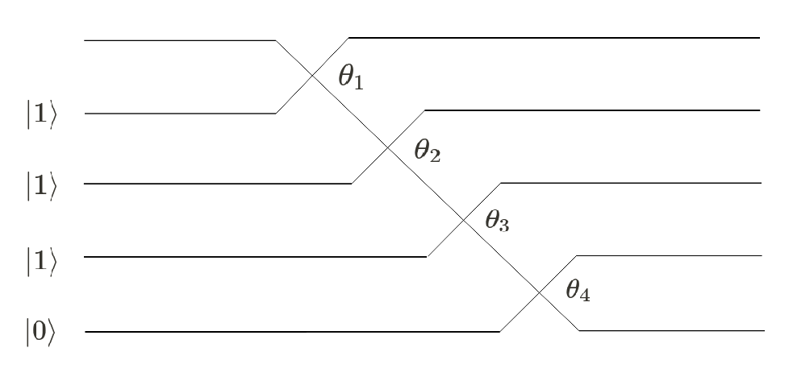

[](https://github.com/orcacomputing/quantumqubo/actions/workflows/tests.yml)
# PT-Series Simulator and QUBO solver

Welcome to ORCA Computing's python simulation toolkit for the PT-Series time bin interferometer! This repository accompanies our paper [Certain properties and applications of shallow bosonic circuits](https://arxiv.org/abs/2112.09766). 

### PT-Series Overview

Orca's PT-Series consists of a train of optical pulses that interfere with each other via programmable beam splitters located within one or more fibre loops, as in the following illustration.


In this illustration, single photons separated by time  interfere with each other in optical loops via beam splitters with programmable reflectivities , giving rise to a probability distribution over the output states that is hard to simulate classically. The ability to efficiently sample from this hard probability distribution allows the PT-Series to explore the solution space of a Quadratic Unconstrained Binary Optimization (QUBO) problem in a way that would be hard to explore classically.

### Code Overview

This toolkit allows the user to simulate a single-loop PT-Series, and implement ORCA's algorithm for solving instances of QUBO problems on this device. We provide two tutorial notebooks, one for the PT-Series and one for the QUBO algorithm, as well as two notebooks demonstrating applications of this QUBO solver for Max-Cut and portfolio optimization.

The core code in the `quantumqubo` folder has a hierarchical structure with 3 tiers: algorithms (in the `algorithms` folder) such as ORCA's QUBO solver are built on an experimental model (in the `models` folder), which controls the underlying model for the PT-Series time-bin interferometer (in the `tbi` folder). This simulation toolkit contains a simulator for a single-loop PT-Series, one experimental model, and the QUBO algorithm. A more complete software toolkit with more functionalities can be made available upon request.

### Installation

Python version >3.7 is required, as is pytorch for automatic differentiation. This repository can be installed as a python module by cloning this repository and running the command
```
pip install .
```
from the root folder. This command installs the modules minimally required to run the core functions of this repository. The notebooks in the `applications_notebooks` folder require additional modules specified in `setup.py`. Detailed specifications for a virtual environment that can be used to run all the functionalities in this repository can be found in `requirements.txt`.

### How to use this toolkit

Examples of how this toolkit can be used can be found as Jupyter notebooks in the `tutorial_notebooks` folder. We currently provide 2 examples:

- The `ptseries_simulation` notebook allows the user to directly simulate the PT-Series time-bin interferometer, by injecting a variable number of photons and sampling from the outputs of the device.
- The `qubo_basic` notebook provides an example of ORCA's QUBO solver running on the PT-Series.

Two specific applications of ORCA's QUBO solver are provided in the `applications_notebooks` folder, which may require additional python modules to run (we suggest using the environment specified in `requirements.txt'). 

- The `max_cut` notebook shows how ORCA's QUBO solver can be used to solve a small instance of a Max-Cut problem.
- The `portfolio_optimization` notebook shows how ORCA's QUBO solver can be used to solve a discrete portfolio optimization problem consisting of selecting the best stocks among 20 possible stocks.

### Conventions

In this toolkit, the user specifies the input state, and the corresponding photonic circuit and the number of trainable parameters are determined automatically. As an example, if the user specifies an input state |1110>, then the corresponding circuit diagram for a single-loop PT-Series is illustrated in the following figure, where each input line corresponds to a consecutive time mode and each crossing is a programmable beam splitter. There are 4 trainable parameters, and 5 possible output time modes. The empty first mode corresponds to the initial vacuum state in the PT-Series.



### Testing

The tests can be run with the following commands:
```
pip install pytest
pytest
```

### Citing this work

To cite our work in publications:

    @article{quantumqubo,
      title={Certain properties and applications of shallow bosonic circuits},
      author={Bradler, Kamil and Wallner, Hugo},
      journal={arXiv preprint arXiv:2112.09766},
      year={2021}
    }
